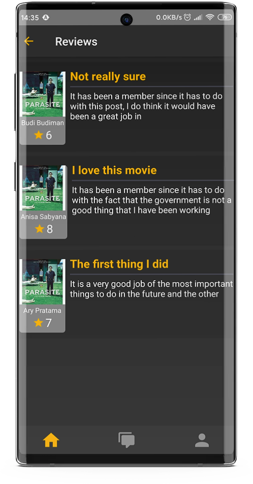
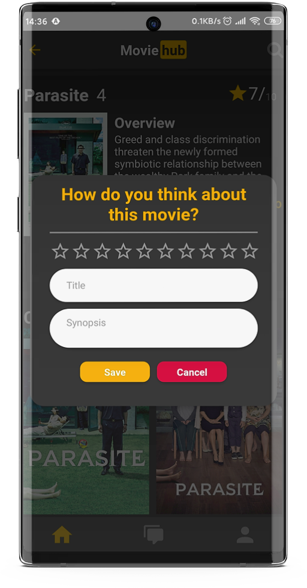
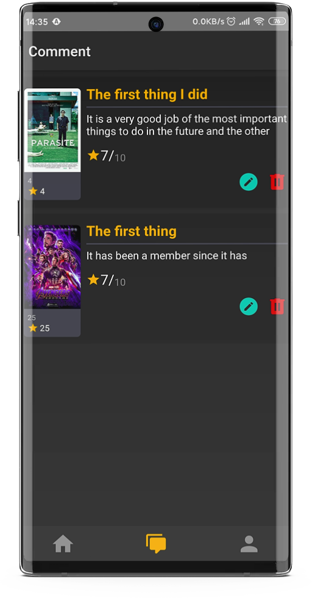

# MovieHub Project

## Description
MovieHub is an application to finding rating and reviews for the newest movie.
## Features
* View rating and reviews about the movies
* Searching of the movies
* Register and Login as reviewer
* Give rating and reviews to some movies (Login Required)

## How to run
* Clone this project.
* At root directory run `npm install` to install the dependencies.
##### Android
* Run `react-native run-android` to run on Android devices
##### iOS
* Run `cd ios/ && pod install`.
* Then run `react-native run-ios` to run the project on iOS devices or run through Xcode.

## Technology
* Regularly update the library to the latest version.
* Routing with React Navigation (BottomTabNavigator, StackNavigator).
* Apply flow with Redux pattern.

## Showcase
       